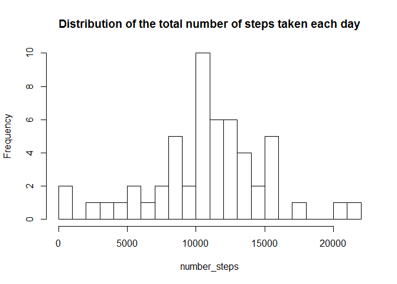
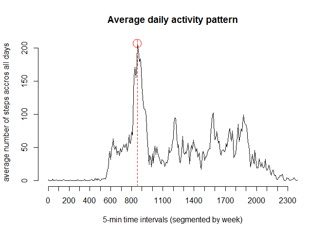
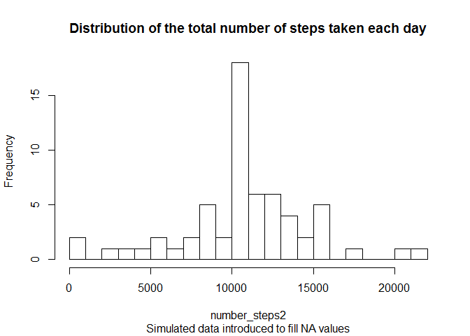
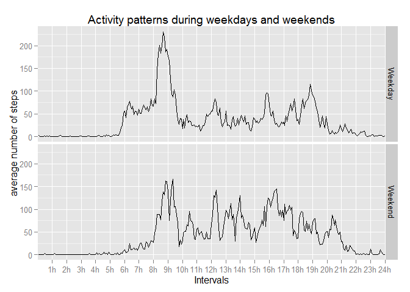

# Reproducible Research: Peer Assessment 1
## Introduction

This report describes the assignment 1 from Coursera "Reproducible Research" course.
Original data used for this assignement were obtained from the "RepData_PeerAssessment1" repository forked from 
rdpeng GitHub account (last commit SHA: 80edf39c3bb508fee88e3394542f967dd3fd3270).
For the Following steps, it is assumed that the working directory is set in the folder that contains "activity.zip" file data.

This report aims at answering these 4 following questions:

- Loading and preprocessing the data

- What is mean total number of steps taken per day?

- What is the average daily activity pattern?

- Imputing missing values

- Are there differences in activity patterns between weekdays and weekends?

The output format of this report is HTML.

## Loading and preprocessing the data

Loading the data contained in the zip file using **read.table** and **unz** functions.

```r
data <- read.table(unz("activity.zip", "activity.csv"), header=T, sep=",")
```

preview of the data loaded.


```r
summary(data)
```

```
##      steps                date          interval     
##  Min.   :  0.00   2012-10-01:  288   Min.   :   0.0  
##  1st Qu.:  0.00   2012-10-02:  288   1st Qu.: 588.8  
##  Median :  0.00   2012-10-03:  288   Median :1177.5  
##  Mean   : 37.38   2012-10-04:  288   Mean   :1177.5  
##  3rd Qu.: 12.00   2012-10-05:  288   3rd Qu.:1766.2  
##  Max.   :806.00   2012-10-06:  288   Max.   :2355.0  
##  NA's   :2304     (Other)   :15840
```

adjusting the format of the *data* variable using the **strptime** function.


```r
data$date <- strptime(data$date, "%Y-%m-%d")
```

## What is mean total number of steps taken per day?

Split the data into groups, and apply the **sum** function to data within each subgroup using **tapply** function.

Creation of the list of factors to split the data: 1 factor per day.

```r
fac <- factor(as.character(strptime(data$date, "%Y-%m-%d")))
```

Calculation of the total number of steps taken per day.


```r
number_steps <- tapply(data[,1], fac, sum)
```

Make a histogram of the total number of steps taken each day.


```r
hist(number_steps,
     main   = "Distribution of the total number of steps taken each day",
     breaks = 20)
```

 

Calculate and report the mean and median of the total number of steps taken per day.


```r
mean_number_steps   <- round(mean(number_steps, na.rm = TRUE), 0)   

median_number_steps <- round(median(number_steps, na.rm = TRUE), 0)
```

The mean (*mean_number_steps*) is equal to 1.0766\times 10^{4} steps.
The median (*median_number_steps*) is equal to 1.0765\times 10^{4} steps.

## What is the average daily activity pattern?

Calculation of the average daily activity pattern, using the **tapply** function.


```r
average_steps <- tapply(data[,1], data[,3], mean, na.rm = TRUE)
```

Identify the 5-min time interval for which the average number of steps accros all days is maximum.


```r
i <- names(which.max(average_steps))
```

Make the plot of the average number of steps accros all days versus time series of the 5-minute interval (x-axis).
Highlight on the maximum the average number of steps accros all days in red. Axes draw separately in order to display 
the right 5-min time intervals.


```r
plot(c(1:288), average_steps, type = "l", axes = FALSE,
     main = "Average daily activity pattern",
     xlab = "5-min time intervals (segmented by week)",
     ylab = "average number of steps accros all days")
axis(2)
axis(1, at = seq(1,288,12), labels = names(average_steps)[seq(1,288,12)])
points(c(1:288)[names(average_steps)==i], max(average_steps), 
       col = "Red", 
       cex = 2.5)     
abline(v=c(1:288)[names(average_steps)==i], col = "Red", lty = 2)
```

 

The 5-minute interval associated to the maximum number of steps is 835.


## Imputing missing values

Calculation of the total number of missing values in the dataset.


```r
summary(data$steps)
```

```
##    Min. 1st Qu.  Median    Mean 3rd Qu.    Max.    NA's 
##    0.00    0.00    0.00   37.38   12.00  806.00    2304
```

```r
Nb_NA <- summary(data$steps)[7]
```
the total number of missing values in the dataset *data* is *Nb_NA* = 2304.

Filling in all of the missing values in the dataset using the mean for corresponding 5-minute interval. The new dataset created is names *data_filled*.


```r
data_filled <- data
for (i in 1:288){
        data_filled[data_filled$interval==names(average_steps)[i]&
                    is.na(data_filled$steps),1] <- average_steps[i]
} 
```
Checking the number of NA values in the new *data_filled* created.


```r
summary(data_filled$steps)
```

```
##    Min. 1st Qu.  Median    Mean 3rd Qu.    Max. 
##    0.00    0.00    0.00   37.38   27.00  806.00
```


Calculation of the total number of steps taken per day the new dataset *data_filled*.


```r
number_steps2 <- tapply(data_filled[,1], fac, sum)
```

Make a histogram of the total number of steps taken each day.


```r
hist(number_steps2,
     main   = "Distribution of the total number of steps taken each day",
     sub    = "Simulated data introduced to fill NA values",
     breaks = 20)
```

 

Calculate and report the mean and median of the total number of steps taken per day.


```r
mean_number_steps2   <- round(mean(number_steps2), 0)   

median_number_steps2 <- round(median(number_steps2), 0)
```

The mean (*mean_number_steps2*) is equal to 1.0766\times 10^{4} steps.
The median (*median_number_steps2*) is equal to 1.0766\times 10^{4} steps.

In the first part of the assignement, the values were equal to 1.0766\times 10^{4} and 1.0765\times 10^{4} steps for the mean and the median respectively. Introducing missing values did not affect the mean values, but affected the median. 

The impact of imputing missing data on the estimates of the total daily number of steps is the creation of a new dataset *data_filled* with an unfiform distribution of the data (mean = median). The rather minor skewness disappeared after this operation. 

## Are there differences in activity patterns between weekdays and weekends?

Creation of a new factor *fac2* variable in the dataset with two levels - "weekday" and "weekend" indicating whether a given date is a weekday or weekend day


```r
fac2 <- weekdays(data$date)
fac2[fac2!="Saturday"&fac2!="Sunday"] <- "weekday"
fac2[fac2=="Saturday"|fac2=="Sunday"] <- "weekend"
```

Calculation of the average weekday and weekend activity pattern, using the **tapply** function.


```r
average_steps_weekday <- tapply(data_filled[fac2=="weekday",1], data[fac2=="weekday",3], mean)
average_steps_weekend <- tapply(data_filled[fac2=="weekend",1], data[fac2=="weekend",3], mean)
```

Create a plot of the results using **ggplot2** package. First step, create the data frame using **reshape** package. 


```r
require(reshape)
```

```
## Loading required package: reshape
```

```r
df <- data.frame(interval = c(1:288),
                 Weekday  = average_steps_weekday,
                 Weekend  = average_steps_weekend)
dfm <- melt(df, id = "interval")
```

Then, creation of the panel plot.

```r
require(ggplot2)
```

```
## Loading required package: ggplot2
```

```r
p <- ggplot(dfm, aes(interval,value)) + geom_line()
p + facet_grid(variable ~ .) + 
    labs(list(title = "Activity patterns during weekdays and weekends",
             x = "Intervals", y = "average number of steps")) +
        scale_x_discrete(breaks = seq(0,288,12), labels=paste(c(0:24),"h",sep=""))
```

 

During the weekdays, there are more steps starting earlier in the morning (around 6 AM) while during the weekend, the number of steps increases later (around 8 AM), and continue later in the evening (peak around 20-21 PM).
